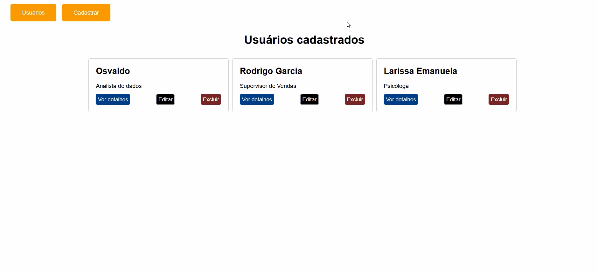

## Instalando Dependências
```bash
cd dados-cadastrais
npm install
npm start
docker run -p 3306:3306 --name ph_mysql -e MYSQL_ROOT_PASSWORD=sua_senha -d mysql:5.7
docker container start ph_mysql
``` 
## Executando aplicação
> A aplicação estará rodando na porta 3000: http://localhost:3000/ do navegador.


